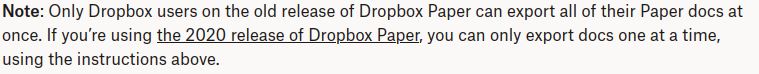

# Dropbox Paper Export 2020+

[Dropbox Paper](https://www.dropbox.com/paper/start) is a great tool for collaborative document editing. Thanks, Dropbox, for giving us such a great tool!

Unfortunately, with modern versions of Dropbox Paper, there's no way to do bulk exports of all your documents. From [the docs](https://help.dropbox.com/view-edit/paper-export-docs):

I can't really justify using Dropbox Paper unless there's a way for me to backup my documents. So I built one!

# Features

* Export all your documents, or just one directory
* Export to Markdown or HTML
* Efficient incremental updates, so subsequent runs happen really fast
* Your authentication details remain on your computer, nobody else ever sees them

# Quick start

1. Make sure you have [Node.js](https://nodejs.org/en/download/) installed, with npm.
2. Install this package globally with `npm install -g dropbox-paper-export-2020plus`.
3. Run `dropbox-paper-export -v ~/paper`. You'll be prompted for authentication, and it will download all your documents the `paper` directory within your home folder. It will take a minute or two.
4. Later on, just keep running `dropbox-paper-export -v ~/paper` any time you want to pull in new changes. Docs will be updated, moved or deleted to reflect the changes you made in Dropbox.

# Usage

`dropbox-paper-export [options] <output-directory>`

## Options:

-v, --verbose
: Print out messages about what's happening

--formats FORMATS
: Export to all the given formats, comma-separated. Defaults to `html,md`

--directory DIR
: Export just the Paper docs in the given Dropbox directory

--fresh
: Don't do an incremental update, but start from scratch

## Advanced options

--client-id ID
: Use a different Dropbox client ID for authorization, instead of the one bundled with this app. Mostly useful if too many people use this tool! See Dropbox's [getting started guide for developers](https://www.dropbox.com/developers/reference/getting-started).
